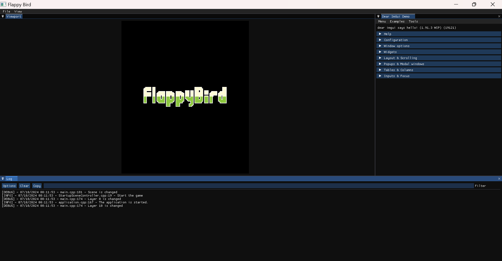
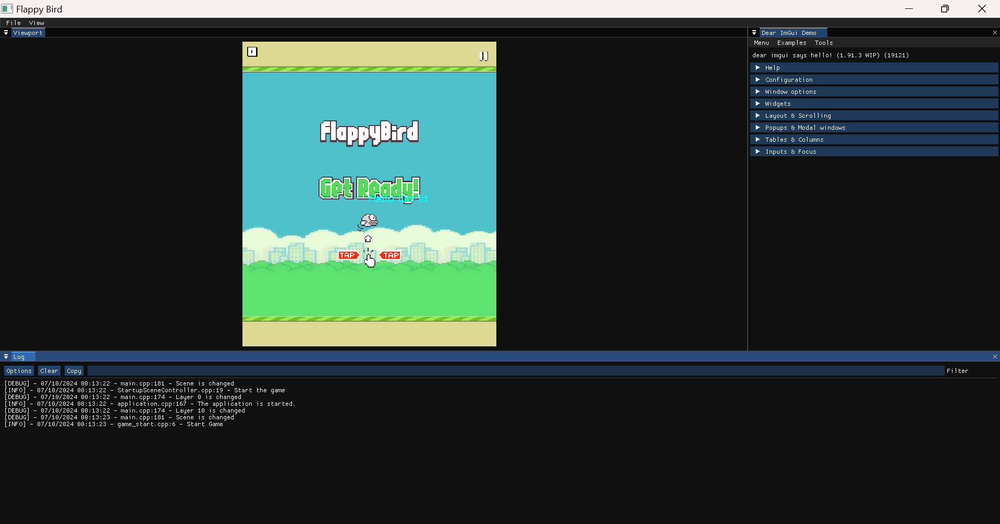
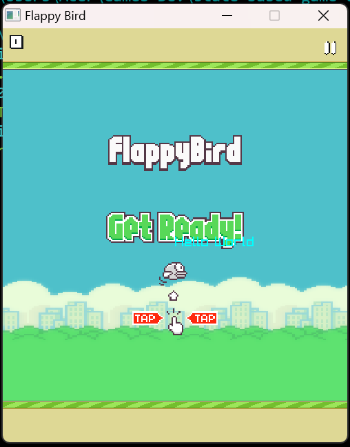
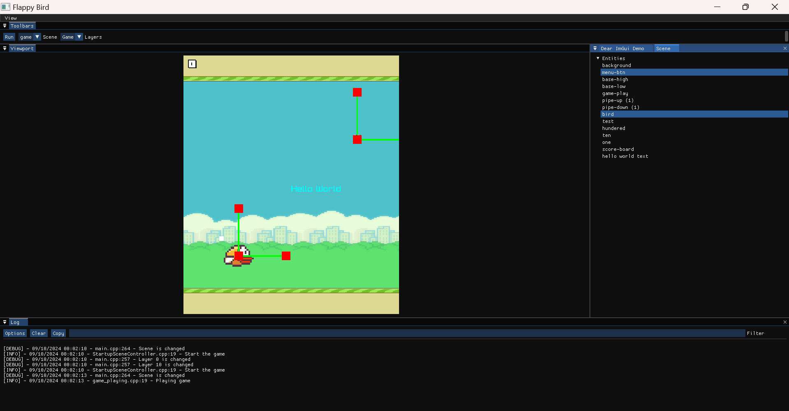

# state-based-game-engine

State Based game engine

### Generating the documentation

```bash
$ cd docs
$ doxygen Doxyfile
```

# State Based Game Engine

This project is a state-based game engine named NTTEngine. It is designed to support various game development functionalities, including:

-   Core Systems: Logging, memory management, profiling, and time management.
-   Application Systems: Input handling, event systems, and hot-reload modules.
-   Rendering: Graphics rendering, mouse hovering, and texturing.
-   Physics: Physics development and integration.
-   Scripting: Native script systems and script resource management.
-   Entity-Component System (ECS): Entity management, component handling, and system updates.
-   Resource Management: Loading, unloading, and managing game resources like images, audio, and scripts.
-   Editor: Tools for game development and debugging.

# Editor

Currently, the editor just supports the logging display, new features will be added soon.


Another scene


At the same time, a .exe file of built game is created beside the editor version.


The entity can be drag (support multiple selection) and drop to the scene.

