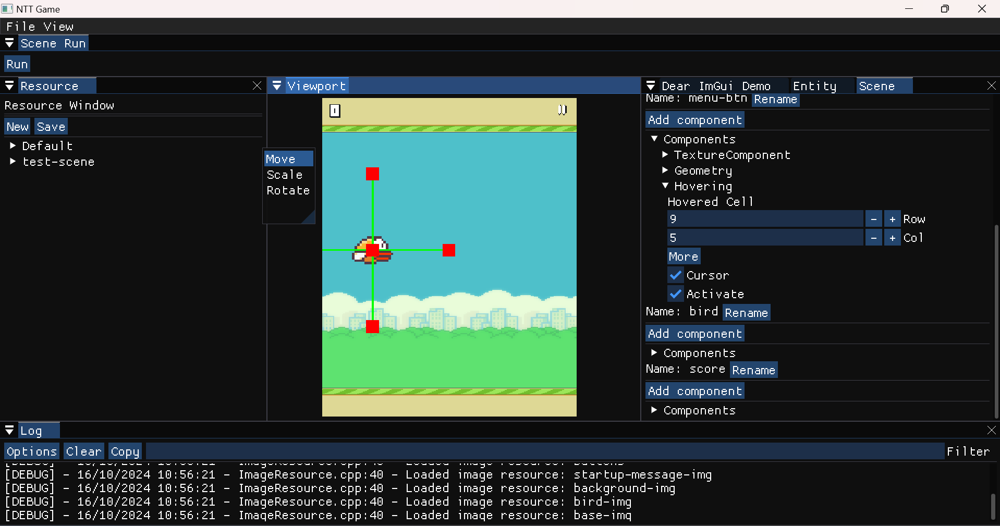
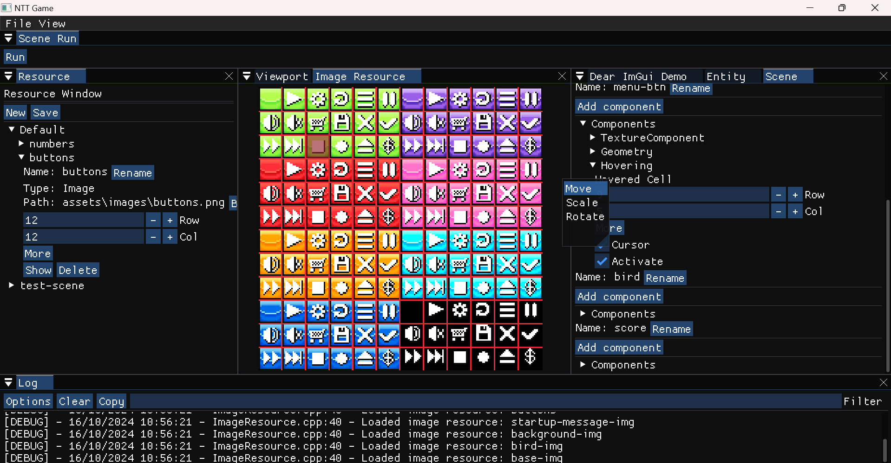
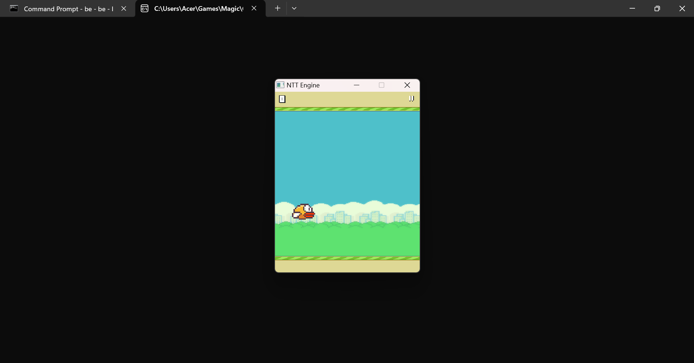

# state-based-game-engine

State Based game engine

### Generating the documentation

```bash
$ cd docs
$ doxygen Doxyfile
```

# State Based Game Engine

This project is a state-based game engine named NTTEngine. It is designed to support various game development functionalities, including:

-   Core Systems: Logging, memory management, profiling, and time management.
-   Application Systems: Input handling, event systems, and hot-reload modules.
-   Rendering: Graphics rendering, mouse hovering, and texturing.
-   Physics: Physics development and integration.
-   Scripting: Native script systems and script resource management.
-   Entity-Component System (ECS): Entity management, component handling, and system updates.
-   Resource Management: Loading, unloading, and managing game resources like images, audio, and scripts.
-   Editor: Tools for game development and debugging.

# Editor

Editor with project creating, scene editing, ...


Editor with resource manager


The game can be run without the editor


# Build from source with CMake

## Windows - MinGW

Generating the build files and building the project with MinGW.

### Debug

```cmd
$ mkdir build
$ WindowBuild/MinGW/gen-build.bat
$ WindowBuild/MinGW/build.bat
$ WindowBuild/MinGW/editor.bat
```

### Release

```cmd
$ mkdir build
$ WindowBuild/MinGW/gen-release.bat
$ WindowBuild/MinGW/build.bat
$ WindowBuild/MinGW/editor.bat
```
